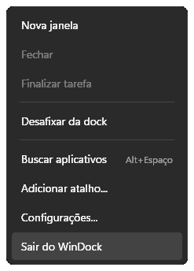
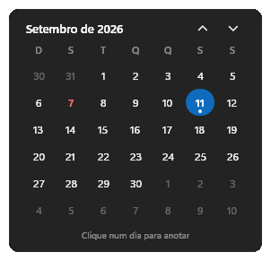
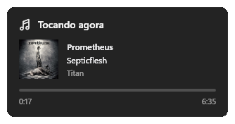
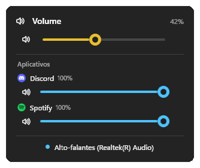
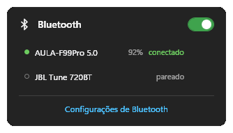
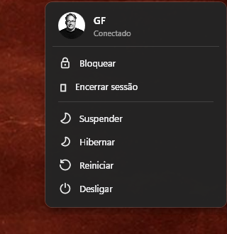
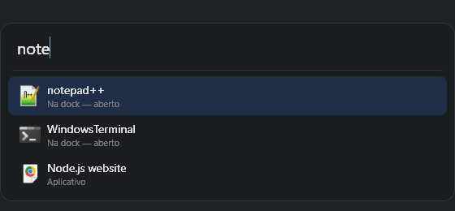
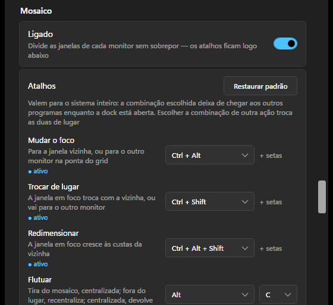

# WinDock — instalar, usar e remover

Guia prático. Para o funcionamento por dentro (por que a dock não rouba foco, como a barra do
Windows é escondida, como a busca acha os apps), veja o [README](../README.md).

## Requisitos

| | |
|---|---|
| Sistema | Windows 10 versão **2004** (build 19041) ou mais novo — inclui todo o Windows 11 |
| Para **rodar** | [.NET 8 Desktop Runtime](https://dotnet.microsoft.com/download/dotnet/8.0) |
| Para **compilar** | .NET 8 SDK (já traz o runtime) |

O piso de versão do Windows subiu de "10 ou 11" para o build 19041 quando o projeto passou a
usar duas APIs WinRT: **ligar e desligar o bluetooth** (`Windows.Devices.Radios`) e os
**controles de mídia** (`Windows.Media.Control`). Não há API clássica equivalente para nenhuma
das duas. O alvo de compilação virou `net8.0-windows10.0.19041.0`, e é ele que define o piso:

```powershell
dotnet msbuild -getProperty:SupportedOSPlatformVersion   # 10.0.19041.0
```

> **Em Windows mais antigo.** As APIs em si existem desde antes (rádios desde o 10 original,
> mídia desde a versão 1803), então dá para baixar o piso acrescentando
> `<SupportedOSPlatformVersion>10.0.17763.0</SupportedOSPlatformVersion>` ao `WinDock.csproj` e
> recompilar. Isso **não foi testado** — se você tiver uma máquina assim, é o primeiro lugar a
> mexer.

Para saber o que existe na máquina:

```powershell
dotnet --list-runtimes
[System.Environment]::OSVersion.Version    # o Build precisa ser >= 19041
```

Se aparecer uma linha `Microsoft.WindowsDesktop.App 8.x`, o runtime está pronto. Não existindo,
ou você instala o runtime, ou gera um executável que não depende de nada (veja
[Sem instalar o .NET](#sem-instalar-o-net)).

## Instalar

### Baixar pronto

Cada versão sai pronta na página **Releases** do repositório, gerada pelo GitHub Actions a partir
da tag (`1.0.0.7`, por exemplo). São dois arquivos:

| arquivo | quando usar |
|---|---|
| `WinDock-<versão>.exe` | ~25 MB; precisa do .NET 8 Desktop Runtime instalado |
| `WinDock-<versão>-standalone.exe` | ~180 MB; roda em máquina sem .NET nenhum |

O executável não é assinado, então na primeira vez o Windows mostra o aviso do SmartScreen
(**Mais informações > Executar assim mesmo**). Baixado, siga do
[passo 2](#2-escolher-onde-ele-vai-morar) em diante.

### 1. Gerar o executável

Para compilar em vez de baixar:

```powershell
cd D:\Projetos\WinDock
dotnet publish -c Release -r win-x64 --self-contained false -p:PublishSingleFile=true -o dist
```

Sai um `dist\WinDock.exe` de ~25 MB, arquivo único, sem instalador e sem DLL solta ao lado. Quase
todo esse peso é a projeção das APIs WinRT (`Microsoft.Windows.SDK.NET.dll`, 23,7 MB), que o alvo
`10.0.19041.0` traz junto para os controles de mídia e o bluetooth — o código da dock em si não passa
de meio mega.

### 2. Escolher onde ele vai morar

O executável roda de qualquer pasta, mas **não o deixe em `dist`**: a próxima publicação
sobrescreve o arquivo, e a opção "Iniciar com o Windows" guarda o caminho onde ele estava.

```powershell
$destino = "$env:LOCALAPPDATA\Programs\WinDock"
New-Item -ItemType Directory -Force $destino | Out-Null
Copy-Item dist\WinDock.exe $destino -Force
& "$destino\WinDock.exe"
```

### 3. Ligar o início automático

Com a dock na tela: botão direito em qualquer ícone > **Configurações...** > **Iniciar com o
Windows**. Isso cria a tarefa agendada `WinDock`, com gatilho ao fazer logon.

> Se você mover o arquivo depois, desmarque e marque de novo — a tarefa guarda o caminho antigo.

A tarefa é usada no lugar da chave `Run` porque o Windows atrasa de propósito tudo que sobe pela
chave: os aplicativos de inicialização entram numa fila e o primeiro deles só arranca uns dez
segundos depois da área de trabalho aparecer. A tarefa não passa por essa fila. Quem já tinha o
início automático ligado pela chave é migrado sozinho, na primeira vez que abrir esta versão.
Se a política da máquina não deixar criar tarefas, a chave `Run` volta a ser usada.

### Sem instalar o .NET

Trocando um parâmetro, o executável passa a carregar o runtime dentro dele:

```powershell
dotnet publish -c Release -r win-x64 --self-contained true -p:PublishSingleFile=true -p:IncludeNativeLibrariesForSelfExtract=true -o dist-standalone
```

Fica com ~180 MB em vez de ~25 MB, e roda em máquina sem .NET nenhum. O
`IncludeNativeLibrariesForSelfExtract` não é enfeite: sem ele saem, ao lado do executável, cinco DLLs
nativas do WPF (`D3DCompiler_47_cor3.dll`, `wpfgfx_cor3.dll` e companhia), e o "arquivo único" deixa
de ser verdade.

## Rodar

```powershell
WinDock.exe              # a dock
WinDock.exe --settings   # a dock, já abrindo o painel de configurações
```

Só existe **uma dock por vez**. Abrir o `WinDock.exe` de novo com ela já rodando não cria uma
segunda: a nova sai na hora e a que está aberta mostra o painel de configurações.

A dock pede **permissão de administrador** ao abrir (o aviso do UAC). É o que deixa o mosaico e o
contorno funcionarem também sobre programas abertos como administrador: sem ela, o Windows não
deixa um programa comum mexer na janela de um elevado. O custo é não dar para arrastar arquivos do
Explorer para cima da dock. No início automático o aviso não aparece — a tarefa agendada já sobe
com os privilégios mais altos.

### A dock


| ação | como |
|---|---|
| Ativar / minimizar um app | clique no ícone |
| Alternar entre janelas do mesmo app | clique de novo |
| Ver as janelas de um app | pare o mouse no ícone (a partir de duas janelas) |
| Ir para uma janela específica | clique na miniatura dela |
| Fechar uma janela sem abri-la | passe o mouse na miniatura e clique no **✕**, ao lado do título (o painel fica aberto para fechar as outras) |
| Menu (nova janela, abrir local do arquivo, fechar, finalizar tarefa, fixar ou desafixar) | botão direito no ícone |
| Abrir a pasta do programa, com ele selecionado | botão direito > **Abrir local do arquivo** (apagado para apps da Store, cuja pasta o Windows fecha por permissão) |
| Fixar um atalho específico (`.lnk`) | botão direito > **Adicionar atalho...** |
| Reordenar | arraste um ícone sobre o outro |
| Abrir o 1º, 2º... ícone pelo teclado | `Alt+1` a `Alt+9` (desligável em **Configurações > Abrir pela posição com Alt+número**) |
| Configurações | botão direito > **Configurações...** |
| Sair | botão direito > **Sair do WinDock** |



**Sempre saia pelo menu.** Ao sair, a dock devolve a faixa de tela que reservou e traz de volta
a barra do Windows, se você a tinha escondido. Matar o processo à força pula essa parte — veja
[Se algo ficou fora do lugar](#se-algo-ficou-fora-do-lugar).

### A barra de cima


Da esquerda para a direita: o que está tocando, os controles de faixa, bateria, wi-fi,
bluetooth, volume, a seta da bandeja, notificações e energia — mais o **brilho**, quando o
monitor aceita ser controlado (veja [Brilho](#brilho)), a **cota de IA**, se você ligar
(veja [Cota de IA](#cota-de-ia)), e o **pen-drive**, enquanto houver um espetado
(veja [Remover dispositivo externo](#remover-dispositivo-externo)). **A ordem é sua** — veja
[Ordem dos itens](#ordem-dos-itens-da-barra).

| ação | como |
|---|---|
| Calendário do mês | clique na data |
| Ver, anotar e mover as tarefas de um dia | clique no dia dentro do calendário |
| Ver os ícones da bandeja | a seta `⌄` |
| Abrir um programa da bandeja | clique no ícone dele |
| Menu de um programa da bandeja (Sair, etc.) | botão direito no ícone dele |
| Ajustar o volume sem abrir nada | role a roda do mouse sobre o alto-falante |
| Volume de um programa só | clique no alto-falante > seção **Aplicativos** |
| Pausar, avançar, voltar a faixa | os botões ao lado do nome da música |
| Ver a faixa inteira, com capa | clique no nome da música |
| Desligar, reiniciar, hibernar, bloquear, sair | o botão de energia |
| Brilho do monitor | clique no ícone de brilho, ou role a roda do mouse sobre ele |
| Quanto da cota do Claude já foi usada | clique no velocímetro (veja [Cota de IA](#cota-de-ia)) |
| Abrir um pen-drive ou HD externo | clique no pen-drive > **Abrir** |
| Remover um pen-drive ou HD externo | clique no pen-drive > **Remover** (veja [Remover dispositivo externo](#remover-dispositivo-externo)) |
| Trocar de mês no calendário | as setas do cabeçalho, ou a roda do mouse sobre o mês |
| Fechar o cartão aberto | `Esc`, ou clique fora dele |

#### Calendário



Clique na data, na barra de cima, e o mês aparece. Dentro dele:

- **Feriados nacionais em vermelho**, com o nome na dica de mouse. São calculados, não uma lista
  fixa: os móveis (Carnaval, Sexta-feira Santa, Corpus Christi) saem da data da Páscoa, então
  qualquer ano que você folhear vem certo, sem internet e sem atualizar nada todo ano. A
  quarta-feira de cinzas fica de fora de propósito — é dia útil.
- **Anotações em azul**, com um pontinho embaixo do número — que fica **verde** quando tudo do dia
  já está marcado como feito. **Clique num dia** e as tarefas dele aparecem embaixo do mês, no
  próprio cartão, com um anel em volta do dia; clicar de novo no mesmo dia recolhe a lista. Tudo
  acontece ali: a bolinha marca como concluído (o texto fica riscado), o `✕` remove, e o campo
  **Nova tarefa** acrescenta com `Enter` ou com o `+`.
- **O teclado só vai para o cartão quando você clica num campo.** A barra de cima normalmente não
  recebe teclado — é o que a deixa ser clicada sem tirar o foco do programa em que você está. Ao
  clicar no campo ela pega o teclado, e ao fechar o cartão devolve o foco ao programa de antes.
- **Tarefas concluídas se apagam sozinhas** depois de **2 dias**, contando de quando foram marcadas
  como feitas (desmarcar zera a contagem). O prazo — ou **Nunca** — fica em
  **Configurações > Apagar tarefas concluídas**. A limpeza acontece ao abrir o calendário, então nada
  some com a lista aberta na sua frente.
- **Marcar, remover e mover gravam na hora.** Uma tarefa nova só é gravada com `Enter` ou com o
  `+`: fechar o cartão (`Esc` ou clique fora) com algo escrito no campo **descarta** o texto.
- **Mover uma tarefa**: o `→` abre um campo já preenchido com o dia seguinte, e `Enter` (ou
  **Mover**) leva a tarefa; **Cancelar** desiste. Dia e mês bastam (`15/09`); sem o ano vale o do
  dia aberto, e uma data que cairia muito para trás (digitar `05/01` com um dia de dezembro aberto)
  é entendida como o ano que vem.

As anotações ficam em `CalendarNotes`, no `config.json`.

Feriados estaduais e municipais não entram: não há regra nacional para eles. Anote-os como
anotação comum, que o dia fica marcado do mesmo jeito.

#### Música



Aparece **só quando há algo tocando** e some sozinho quando para. Funciona com qualquer programa
que publique mídia no Windows — Spotify, navegador, VLC —, sem configurar nada. Clicando no nome
abre o card com a capa, o álbum e a linha do tempo, que **aceita clique para pular** na faixa.

Se você quiser a barra só para um programa (o Spotify, por exemplo, sem que um vídeo no
navegador tome o lugar dele), marque-o em **Configurações > Programas na barra de mídia**. Sem
nenhum marcado, vale para todos.

Pelo teclado, de qualquer programa: `Alt+Shift+←` volta a faixa, `Alt+Shift+→` passa e
`Alt+Shift+↑` pausa ou retoma. Os atalhos seguem o mesmo filtro de programas, trocam-se em
**Configurações > Mosaico > Atalhos** (linha **Música**) e só existem com a barra superior ligada.

#### Volume



A barra muda de cor conforme o nível: verde abaixo de 30%, amarelo até 70%, vermelho acima —
e cinza quando está mudo. Cada programa com som ganha o próprio controle; um programa aparece
uma vez só, mesmo abrindo vários fluxos de áudio (o Discord abre dois).

#### Bandeja


Com a barra do Windows escondida, é aqui que o antivírus e os programas que só vivem na bandeja
continuam alcançáveis. O cartão abre na hora com o que já se sabia e relê o painel do próprio
Windows por trás, então mostra exatamente o que ele mostra. **Some sozinho depois de três
segundos** parado, e a contagem reinicia enquanto o mouse estiver dentro.

Alguns programas não informam o próprio nome ao Windows e aparecem como "Ícone da bandeja 5".
Para esses, **Configurações > Ícones sem nome** deixa você dar um apelido, com o desenho do
ícone ao lado para você saber qual é qual.

#### Bluetooth



O interruptor no cabeçalho liga e desliga o rádio. Cada aparelho mostra a **bateria**, quando
ele informa (em geral os Bluetooth LE), e "conectado" em verde quando está em uso de verdade —
não apenas pareado. O `✕` que aparece ao passar o mouse esconde o aparelho da lista sem
despareá-lo no Windows.

#### Brilho

Aparece só em monitor que aceita controle por **DDC/CI** — em geral os externos; o painel de
notebook costuma não aceitar, e ali o item some sozinho. O ajuste vai direto para o monitor, como
os botões físicos dele. Para não ter o item nem onde ele funciona, desligue
**Configurações > Indicador de brilho**.

#### Remover dispositivo externo

Um ícone de pen-drive aparece na barra assim que você espeta um pen-drive, cartão de memória ou
HD externo — e some sozinho quando o último sai. **Só existe enquanto houver o que remover**: não
é um botão que passa o dia parado dizendo "nenhum dispositivo".

Clique nele e o cartão lista o que está conectado, um por linha: o nome do aparelho, as letras que
ele montou e o tamanho. Cada linha tem duas ações:

- **Abrir** — a pasta do aparelho no Explorer, e o cartão se fecha. Um aparelho com duas
  partições abre as duas janelas: são os dois volumes dele.
- **Remover** — o Windows é avisado de que aquele aparelho vai sair.

Um aparelho por linha, e não uma letra por linha: um HD externo particionado em duas aparece uma
vez só, com "E:, F:" ao lado. Quem sai da máquina é o aparelho inteiro.

**Quando dá certo**, a linha some e o cartão diz que você já pode desconectar. **Quando não dá**,
ele diz o motivo — em geral porque algum programa ainda está com um arquivo aberto ali, e o
Windows costuma dizer qual. Feche o programa e clique de novo. A dock **não força** a remoção: é
exatamente a mesma via do "Remover hardware com segurança" da bandeja do Windows, e um pedido
recusado é o aviso de que ainda há coisa por gravar.

Para não ter o botão nem quando há dispositivo, desligue **Configurações > Remover dispositivo
externo**.

#### Cota de IA

Quanto da sua cota do Claude já foi usada — a janela de **5 horas**, a de **7 dias** e as que
houver por modelo —, cada uma com o quanto falta para zerar. É o mesmo número que o `/usage` do
Claude Code mostra.

No topo de cada bloco fica **de quem é essa cota**: o nome, a conta, a organização e o papel nela
quando houver, e o plano na cápsula à direita. Nome, e-mail e organização saem do `.claude.json`,
o arquivo onde o Claude Code guarda quem está logado; o plano vem da credencial.

**Mais de uma conta.** O Claude Code usa uma conta por vez, mas a variável `CLAUDE_CONFIG_DIR`
permite apontá-lo para outra pasta — é assim que se mantém a conta pessoal e a da empresa lado a
lado, cada uma com o seu login. O WinDock acha todas sozinho: toda pasta `%USERPROFILE%\.claude*`
com uma credencial dentro é uma conta, mais a que a variável apontar. O cartão mostra uma embaixo
da outra, separadas por uma linha.

Havendo mais de uma, aparece em **Configurações > Contas no cartão de cota** uma lista para
escolher quais acompanhar. Sem nenhuma marcada, o cartão mostra todas — inclusive as que
passarem a existir depois. Com uma conta só, esse cartão de configuração nem aparece: não há o
que escolher.

**Compacto ou detalhado.** A seta no rodapé do cartão alterna entre os dois, e o que você
escolher fica. O compacto — que é como ele começa — põe cada janela de cota numa linha só, com a
barra entre o nome e a porcentagem; some a linha da conta e o "zera em". Com duas contas, ele tem
pouco mais da metade da altura do detalhado.

Vem desligado, em **Configurações > Cota de IA**, e mesmo ligado só aparece se você usa o Claude
Code nesta máquina: o cartão se autentica com a credencial que ele guarda em
`%USERPROFILE%\.claude\.credentials.json`, e sem ela não haveria o que mostrar. O número é
buscado de dez em dez minutos e toda vez que você abre o cartão.

Três coisas que vale saber:

- **A dock nunca escreve nessa pasta.** A credencial vence de tempos em tempos e renová-la
  significaria gravar por cima do arquivo do Claude Code — duas coisas escrevendo no mesmo lugar é
  como se perde o login. Quando vencer, o cartão diz **"Sessão expirada"** e volta ao normal
  assim que você usar o Claude Code, que renova sozinho.
- **Seu token não vai para o log**, nem inteiro nem em pedaço.
- **A fonte não é uma API pública.** É o mesmo endereço que o Claude Code usa, e ele pode mudar
  sem aviso. Se mudar, o cartão passa a dizer que não conseguiu ler — nada mais na dock depende
  disso.
- **A cota é consultada no máximo de dois em dois minutos por conta.** Abrir o cartão dez vezes
  seguidas não faz dez consultas: ele mostra o que já tem. Se mesmo assim a API pedir uma pausa
  (o `429`), a dock espera o tempo que ela pedir — ou dez minutos — e, enquanto isso, **continua
  mostrando os últimos números**, com um aviso em âmbar dizendo de quando eles são.

#### Energia



Sua foto e o nome da conta no topo, depois as opções. A linha separa o que mexe **só na sua
sessão** (bloquear, encerrar sessão) do que mexe **na máquina inteira** — a ordem também põe o
que interrompe o trabalho embaixo, longe da borda de cima, onde o cursor chega primeiro.

### Buscar aplicativos (`Alt+Espaço`)



Digite parte do nome; `↑` `↓` andam na lista e `Enter` abre. `Esc` fecha.

Para **executar um comando, caminho ou endereço**, use o prefixo `run`:

```
run notepad              run - notepad          run -notepad
run https://exemplo.com  run \\servidor\pasta
```

O traço é opcional e maiúsculas não importam. Buscar por `runtime` ou `rundll32` continua
achando os aplicativos: o prefixo só vale com um espaço ou traço depois dele.

Quantos resultados a lista mostra fica em **Configurações > Resultados na busca** (de 3 a 20).

### Mosaico de janelas

Organiza as janelas lado a lado, sem sobreposição, e mantém o arranjo conforme você abre e fecha
programas. Liga em **Configurações > Mosaico**.

Os atalhos abaixo são os **padrões**. Todos podem ser trocados ou desligados em
**Configurações > Mosaico > Atalhos**, escolhendo entre combinações que não brigam com as do
Windows. Cada linha mostra se o atalho está ativo ou se outro programa já tomou aquela
combinação. Escolher a combinação de outra ação troca as duas de lugar.



| padrão | o que faz |
|---|---|
| `Ctrl+Alt+setas` | move o foco para a janela vizinha, inclusive no outro monitor |
| `Ctrl+Shift+setas` | troca a janela de lugar com a vizinha |
| `Ctrl+Alt+Shift+setas` | redimensiona a janela (a vizinha cede o espaço) |
| `Alt+C` | tira a janela do mosaico, centralizada (flutuando fora do lugar, recentraliza; já centralizada, volta pro mosaico) |
| `Alt+Shift+C` | devolve ao mosaico, de uma vez, todas as janelas que abriram flutuando |
| `Alt+Z` | minimiza a janela em foco |
| `Alt+W` | fecha a janela em foco |
| `Ctrl+Alt+C` | esquece o tamanho flutuante guardado do programa em foco |
| `Alt+T` | prende a janela em foco acima das outras (de novo, solta) |
| `Alt+Shift+← → ↑` | música: anterior, próxima, tocar ou pausar (vale com o mosaico desligado; precisa da barra superior) |
| `Ctrl+Alt+S` | abre as Configurações; já abertas, traz para a frente (vale com o mosaico desligado) |

Arrastar a divisória entre duas janelas também redimensiona. Uma janela minimizada **guarda o
lugar dela** e volta para a mesma posição ao ser restaurada.

Uma janela solta (flutuante, fora do mosaico, ou uma caixa de tamanho fixo) **largada em cima da
dock** — ou embaixo da barra superior — volta sozinha para a área livre ao soltar o mouse, com o
mesmo tamanho. Maximizada e tela cheia ficam como estão, e pelas laterais nada muda.

Cada programa tem **o seu tamanho de janela flutuante**: redimensione uma janela em modo
flutuante e é assim que as próximas desse programa vão nascer, sempre centralizadas no monitor
em que estiverem. Na primeira vez, sem tamanho guardado, a janela ocupa 60% da tela. O tamanho
fica em **Configurações > Tamanho das janelas flutuantes**, onde dá para esquecer um app ou todos,
e no `FloatingSizes` do `config.json`, com o nome do executável (ou o AppUserModelID, que é
o que separa um perfil do Chrome do outro); apagar uma linha de lá devolve o app aos 60%. Uma
janela maximizada não conta como escolha de tamanho.

### Abrir flutuando

Ligando **Configurações > Mosaico > Abrir flutuando**, toda janela nova nasce fora do grid —
centralizada, no tamanho guardado daquele programa (ou 60% da tela, na primeira vez). O mosaico
deixa de ser o destino automático e passa a ser um gesto seu: `Alt+C` põe a janela em foco no
grid, e `Alt+Shift+C` põe todas as que abriram flutuando de uma vez.

As janelas que você mandou flutuar à mão ficam onde estão — o `Alt+Shift+C` não desfaz escolha
sua. E as que já estavam abertas quando a dock subiu continuam no mosaico: a opção só vale do
momento em que a janela aparece.

Programas que não devem entrar no mosaico vão em **Configurações > Mosaico > Exceções**.
Aceita três formas:

- `Master.exe` — o nome do executável;
- `Microsoft.WindowsCalculator_8wekyb3d8bbwe!App` — o AppUserModelID, para apps como a Calculadora
  e as Configurações, cuja janela pertence ao `ApplicationFrameHost.exe` e não ao próprio app;
- `classe:OperationStatusWindow` — a classe da janela, quando só **uma** janela do programa
  incomoda — excluir o executável inteiro levaria junto todas as outras janelas dele. (A caixa
  "0% concluído" do Explorer, o caso clássico, já fica de fora sozinha e aparece centralizada.)
  Para descobrir a classe, ligue **Registrar cada passo no log** (veja abaixo) e procure as linhas
  `Refresh: ... [Classe] fora do mosaico`.

### Registrar cada passo no log

O log em `%APPDATA%\WinDock\windock.log` guarda o que deu errado. Ligando **Registrar cada passo no
log**, ele passa a guardar também o que deu certo — cada janela que entra e sai do mosaico e por
quê, cada leitura da bandeja, cada atalho registrado ao subir. É o que responde "por que essa
janela não entrou no mosaico" sem adivinhação.

Fica desligado, e não por causa do espaço em disco: cada passo é uma escrita, e com o disco ocupado
— descompactando um arquivo grande, por exemplo — é a dock que espera na fila do disco. Ligue
enquanto investiga alguma coisa e desligue depois. Vale na hora, sem reiniciar a dock.

O arquivo enche rápido com isso ligado: aos 256 KB ele vira `windock.1.log` e um novo começa, então
a volta anterior fica guardada. Se a dock não chegar a abrir — e aí não há painel onde clicar —, um
arquivo vazio chamado `rastrear` nessa mesma pasta liga o rastro já no arranque seguinte.

### Ordem dos itens da barra

**Configurações > Ordem dos itens da barra** lista os onze itens do canto direito com setas para
mover. A barra muda na hora. A música entra como **dois itens separados** (a informação e os
controles), então dá para afastá-los ou juntá-los.

## Atualizar

1. Saia pela dock (botão direito > **Sair do WinDock**) — com o app rodando, o arquivo fica
   travado e a publicação falha com `MSB3021`;
2. baixe a versão nova nas **Releases**, ou rode o `dotnet publish ...` de novo (o comando da
   instalação);
3. copie o executável novo por cima do que está em uso;
4. abra outra vez.

Suas preferências e os apps fixados ficam em `%APPDATA%\WinDock\config.json` e sobrevivem à
troca do executável.

## Remover

```powershell
# 1. feche a dock pelo menu (botão direito num ícone > Sair do WinDock)

# 2. tire do início automático (a tarefa, e a chave Run se ela tiver sido usada)
schtasks /delete /tn WinDock /f 2>$null
Remove-ItemProperty -Path "HKCU:\Software\Microsoft\Windows\CurrentVersion\Run" `
                    -Name WinDock -ErrorAction SilentlyContinue

# 3. apague o executável
Remove-Item "$env:LOCALAPPDATA\Programs\WinDock" -Recurse -Force -ErrorAction SilentlyContinue

# 4. apague as preferências (opcional: aqui estão os apps fixados)
Remove-Item "$env:APPDATA\WinDock" -Recurse -Force -ErrorAction SilentlyContinue
```

Não há nada além disso: sem serviço, sem entrada em "Aplicativos instalados", sem arquivo em
`Program Files`.

## Onde ficam os arquivos

| o quê | onde |
|---|---|
| Executável | onde você copiou (sugestão: `%LOCALAPPDATA%\Programs\WinDock`) |
| Preferências e apps fixados | `%APPDATA%\WinDock\config.json` |
| Início automático | tarefa agendada `WinDock` (plano B: `HKCU\Software\Microsoft\Windows\CurrentVersion\Run`, valor `WinDock`) |

O `config.json` pode ser editado à mão com a dock fechada; ela grava o arquivo ao sair, então
uma edição feita com o app aberto seria sobrescrita.

## Se algo ficou fora do lugar

### A área de trabalho ficou encolhida, ou a barra do Windows sumiu

Acontece se o processo for morto à força (Gerenciador de Tarefas, `Stop-Process -Force`,
queda de energia) enquanto a barra estava escondida: a dock não chega a desfazer o que fez.
Abrir e sair pelo menu resolve. Para consertar sem abrir a dock:

```powershell
Add-Type @'
using System;
using System.Runtime.InteropServices;
public static class Fix {
  [StructLayout(LayoutKind.Sequential)] public struct RECT { public int L, T, R, B; }
  [StructLayout(LayoutKind.Sequential)] public struct MONITORINFO { public int cb; public RECT mon; public RECT work; public uint f; }
  [StructLayout(LayoutKind.Sequential)] public struct POINT { public int X, Y; }
  [DllImport("user32.dll")] public static extern IntPtr FindWindow(string c, string n);
  [DllImport("user32.dll")] public static extern bool ShowWindow(IntPtr h, int c);
  [DllImport("user32.dll")] public static extern IntPtr MonitorFromPoint(POINT p, uint f);
  [DllImport("user32.dll")] public static extern bool GetMonitorInfo(IntPtr m, ref MONITORINFO i);
  [DllImport("user32.dll")] public static extern bool SystemParametersInfo(uint a, uint b, ref RECT r, uint c);
  public static void Run() {
    ShowWindow(FindWindow("Shell_TrayWnd", null), 5);          // barra de volta
    var p = new POINT();
    var mi = new MONITORINFO(); mi.cb = Marshal.SizeOf(typeof(MONITORINFO));
    GetMonitorInfo(MonitorFromPoint(p, 1), ref mi);
    var work = mi.work;
    SystemParametersInfo(0x002F, 0, ref work, 0x0002);         // shell recalcula a área útil
  }
}
'@
[Fix]::Run()
```

Reiniciar o Explorer (`Stop-Process -Name explorer -Force`) também resolve, ao custo de fechar
as janelas do Explorer abertas.

### `Alt+Espaço` não abre a busca

Outro programa já registrou o atalho — o **PowerToys Run** usa o mesmo por padrão. A dock avisa
na abertura quando não consegue registrar. Saídas: desligar o atalho no outro programa, ou usar
o menu de contexto da dock > **Buscar aplicativos**.

### A busca demora na primeira vez

Nos primeiros segundos depois do logon a dock ainda está montando a lista de aplicativos em
segundo plano. Passado isso, cada busca leva menos de 2 ms.

### Um ícone não abre nada ao ser clicado

A dock registra o que falhou em `%APPDATA%\WinDock\windock.log`:

```powershell
Get-Content "$env:APPDATA\WinDock\windock.log" -Tail 20
```

**"falha ao abrir"** é alvo que mudou de lugar. App que se atualiza trocando a pasta da versão —
os da Microsoft Store (o Spotify) e os instalados pelo Squirrel (o Discord, o Postman) — é
consertado sozinho: em até meio minuto a dock acha a pasta nova e registra
`fixado '...': o app mudou de versão`. Para um programa reinstalado em outro lugar, apague o botão
e fixe de novo.

**"a janela não veio para a frente"** é o Windows recusando a troca de foco para aquela janela. A
própria linha ainda sugere "app rodando como administrador", mas essa deixou de ser a causa desde
que a dock passou a rodar elevada — o identificador e o título da janela que vêm junto são o ponto
de partida para investigar.

Num ícone da **bandeja**, **"a bandeja mudou desde a última leitura"** quer dizer que um ícone
apareceu ou sumiu depois de a lista ter sido lida — a dock prefere não acionar nada a acionar o
ícone errado. Clique na seta duas vezes para reler e tente de novo.

Arquivo vazio ou inexistente significa que nada falhou — se ainda assim o clique não faz o que
você espera, é comportamento e não erro (por exemplo: clicar no app que já está em foco minimiza).

### A publicação falha com `MSB3021` / arquivo em uso

A dock está rodando e segurando o `.exe`. Saia por **Sair do WinDock** e publique de novo.

### A dock não aparece

Confira se o processo subiu:

```powershell
Get-Process WinDock -ErrorAction SilentlyContinue | Select-Object Id, Path
```

Se estiver rodando e mesmo assim invisível, provavelmente ela está numa borda diferente da que
você espera (ou fora da tela, depois de trocar de monitor). Apague o `config.json` e abra de
novo para voltar aos padrões — os apps fixados se perdem, o resto volta ao normal:

```powershell
Remove-Item "$env:APPDATA\WinDock\config.json"
```
